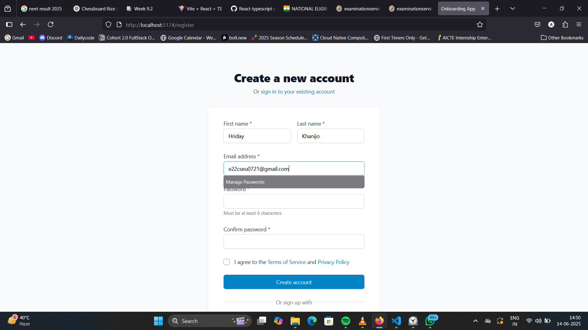
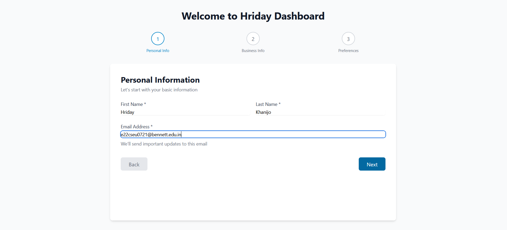
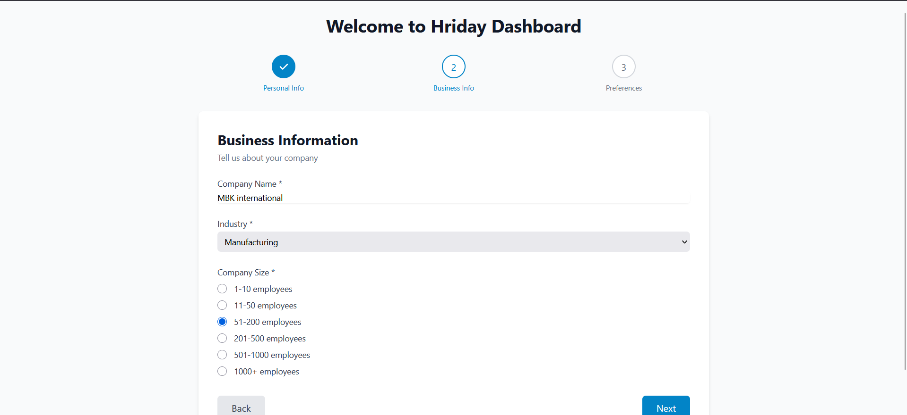
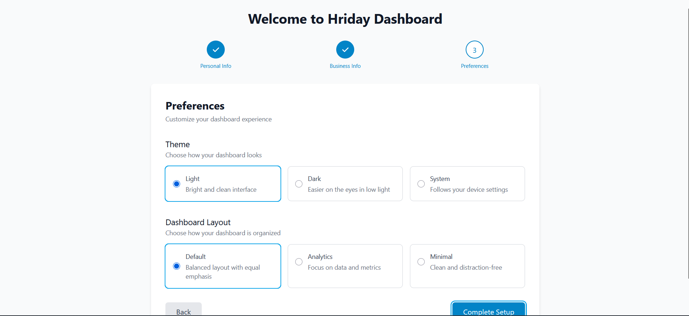
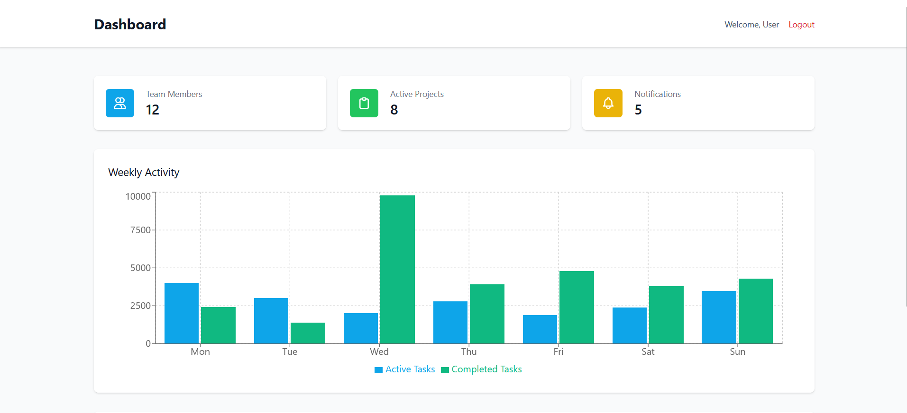

# HRIDAY KHANIJO Internship Project

A full-stack onboarding and dashboard application with user authentication.

## Features

### Frontend
- Multi-step onboarding wizard
- Responsive dashboard
- Theme support
- Form validation
- Smooth transitions

### Backend
- JWT Authentication
- User management
- Preferences API
- Protected routes

## Tech Stack

### Frontend
- React 18
- Tailwind CSS
- Axios
- React Router
- Recharts

### Backend
- Node.js
- Express
- MongoDB/Mongoose
- JWT
- Bcrypt

## Getting Started

### Prerequisites
- Node.js 16+
- npm or yarn
- MongoDB (local or Atlas)

### Installation

1. Clone the repository
2. Install dependencies:
   ```bash
   # Install server dependencies
   cd server
   npm install
   
   # Install client dependencies
   cd ../client
   npm install
   ```

3. Set up environment variables (see .env.example in each directory)

4. Start the development servers:
   ```bash
   # In server directory
   npm run dev
   
   # In client directory (new terminal)
   npm start
   ```

## Project Structure

```
hriday-internship/
├── client/           # Frontend React application
├── server/           # Backend Node.js/Express application
└── README.md
```

## Available Scripts

### Client
- `npm start` - Start development server
- `npm run build` - Build for production
- `npm test` - Run tests
- `npm run lint` - Run linter

### Server
- `npm run dev` - Start development server with nodemon
- `npm start` - Start production server
- `npm test` - Run tests
- `npm run lint` - Run linter


Screenshots







